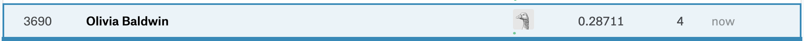
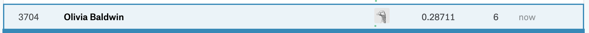

```{r setup, include=FALSE}
# Load all your packages here:
library(tidyverse)
library(scales)
library(Metrics)
library(leaps)


# Set default behavior for all code chunks here:
knitr::opts_chunk$set(
  echo = TRUE, warning = FALSE, message = FALSE,
  fig.width = 16/2, fig.height = 9/2
)

# Set seed value of random number generator here. This is in order to get
# "replicable" randomness, so that any results based on random sampling or
# resampling are replicable everytime you knit this file. Why use a seed value
# of 76? For no other reason than 76 is one of my favorite numbers:
# https://www.youtube.com/watch?v=xjJ7FheCkCU
set.seed(76)
```

You will be submiting an entry to Kaggle's [House Prices: Advanced Regression Techniques](https://www.kaggle.com/c/house-prices-advanced-regression-techniques/){target="_blank"} by fitting a **multiple regression** model $\hat{f}(x)$.


***


# EDA

Read in data provided by Kaggle for this competition. They are organized in the `data/` folder of this RStudio project:

```{r}
training <- read_csv("data/train.csv")
test <- read_csv("data/test.csv")
```


```{r}
#look at the histogram of Sale Price 
ggplot(training, aes(x = SalePrice)) +
geom_histogram() +
labs(x = "Sale price in USD", title = "Outcome variable: sale price")
#look at the histogram of GrLivArea 
```
```{r}
#transform outcome variable 
training <- training %>% mutate(log10_SalePrice = log10(SalePrice))
#histogram of log10_SalePrice
ggplot(training, aes(x = log10_SalePrice)) + geom_histogram() +
labs(x = "log10(Sale price in USD)", title = "Temporary outcome variable: log10(sale price)")
```

Before performing any model fitting, you should always conduct an exploratory data analysis. This will help guide and inform your model fitting. 


```{r}

#histogram of numerical predictor variable 
ggplot(training, aes(x = GrLivArea)) +
geom_histogram() +
labs(x = "Above ground living area in square feet", title = "Predictor variable: living area")

#histogram of numerical predictor variable 
ggplot(training, aes(x = LotFrontage)) +
geom_histogram() +
labs(x = "Above ground living area in square feet", title = "Predictor variable: Lot Frontage")

#histogram of numerical predictor variable 
ggplot(training, aes(x = LotArea)) +
geom_histogram() +
labs(x = "Above ground living area in square feet", title = "Predictor variable: Lot Area")
```

```{r}
training <- training %>%
  mutate(log10_GrLivArea = log10(GrLivArea),
         log10_LotArea = log10(LotArea),
         log10_LotFrontage = log10(LotFrontage))
test <- test %>%
mutate(log10_GrLivArea = log10(GrLivArea),
         log10_LotArea = log10(LotArea),
         log10_LotFrontage = log10(LotFrontage))
```

## Look at your data!

Always, ALWAYS, **ALWAYS** start by looking at your raw data. This gives you visual sense of what information you have to help build your predictive models. To get a full description of each variable, read the data dictionary in the `data_description.txt` file in the `data/` folder.

Note that the following code chunk has `eval = FALSE` meaning "don't evaluate this chunk with knitting" because `.Rmd` files won't knit if they include a `View()`:

```{r, eval = FALSE}
View(training)
glimpse(training)

View(test)
glimpse(test)
```

## Data wrangling

As much as possible, try to do all your data wrangling here:

```{r}
# Data wrangling
training <- training %>%
  # Convert to tibble data frame:
  as_tibble() %>%
  # Add identification variable as first column:
  mutate(ID = 1:n()) %>%
  select(ID, everything())
```


***


# Minimally viable product

## Model fitting

```{r}
model_1 <- lm(log10_SalePrice~log10_GrLivArea+Heating, data=training)
model_1
```


#PREDICT USING MODEL_1 

```{r}
# 2.a) Extract regression table with confidence intervals
model_1 %>%
  broom::tidy(conf.int = TRUE)

# 2.b) Extract point-by-point info of points used to fit model
fitted_points_1 <- model_1 %>%
  broom::augment()
#fitted_points_1
```

```{r}
# 2.c) Extract model summary info
model_1 %>%
  broom::glance()
#transform variables in testdata 


# 3. Make predictions on test data. Compare this to use of broom::augment()
# for fitted_points()
predicted_points_1 <- model_1 %>%
  broom::augment(newdata = test)
#predicted_points_1

```

```{r}
test <- test %>% mutate(
log10_SalePrice_hat = predicted_points_1$.fitted,
SalePrice_hat = 10^log10_SalePrice_hat )
```


## Create your submission CSV

```{r}
test <- test %>% 
  mutate(SalePrice = SalePrice_hat)

submission <- test %>%
  select(Id, SalePrice_hat)

write_csv(submission, path = "data/submission_mvp.csv")
```


## Screenshot of your Kaggle score

{ width=100% }


***


# Due diligence

## Model fitting

```{r}
set.seed(76)
pretend_training <- training %>%
  sample_frac(0.75)
pretend_test <- training %>%
  anti_join(pretend_training, by="ID")

#glimpse(pretend_training)
#glimpse(pretend_test) 
```


```{r}
# 1. Fit model to training data
model_2_formula <- as.formula("log10_SalePrice~log10_GrLivArea+Heating")
model_2 <- lm(model_2_formula, data = pretend_training)

# 2.a) Extract regression table with confidence intervals
model_2 %>%
  broom::tidy(conf.int = TRUE)

# 2.b) Extract point-by-point info of points used to fit model
fitted_points_2 <- model_2 %>%
  broom::augment()
#fitted_points_2

# 2.c) Extract model summary info
model_2 %>%
  broom::glance()

# 3. Make predictions on test data. Compare this to use of broom::augment()
# for fitted_points()
predicted_points_2 <- model_2 %>%
  broom::augment(newdata = pretend_test)
#predicted_points_2

```

```{r}
#UNCONVERT THE LOG IN PRETEND_TEST 
pretend_test <- pretend_test %>% mutate(
log10_SalePrice_hat = predicted_points_2$.fitted,
SalePrice_hat = 10^log10_SalePrice_hat)
```


## Estimate of your Kaggle score

```{r}
rmsle_2 <- Metrics::rmsle(pretend_test$SalePrice, pretend_test$SalePrice_hat)
rmsle_2
```

```{r}
# 3. Make predictions on test data. Compare this to use of broom::augment()
# for fitted_points()
predicted_points_final <- model_2 %>%
  broom::augment(newdata = test)
```

## Create your submission CSV

```{r}

test <- test %>% 
  mutate(SalePrice = SalePrice_hat)
submission <- test %>% 
  select(Id, SalePrice)

write_csv(submission, path = "data/submission_due_diligence.csv")
```


## Screenshot of your Kaggle score

Our score based on our submission's "Root Mean Squared Logarithmic Error" was 0.42918.

{ width=100% }


## Comparisons of estimated scores and Kaggle scores

The score we received on Kaggle was 0.28711 and our estimated score was 0.2902748. Our minimally viable product score was 0.28711.


***


# Reaching for the stars

## Model fitting

```{r}
# Dropped values that were NA for relevant variables
pretend_training <- pretend_training %>%
  drop_na(log10_GrLivArea,Heating,log10_LotArea,SaleCondition,log10_LotFrontage,Street)
test <- test %>%
  drop_na(log10_GrLivArea,Heating,log10_LotArea,SaleCondition,log10_LotFrontage,Street)

# 1. Fit model to training data
model_3_formula <- as.formula("log10_SalePrice~log10_GrLivArea+Heating+log10_LotArea+SaleCondition+log10_LotFrontage+Street")
model_3 <- lm(model_3_formula, data = pretend_training)

# 2.a) Extract regression table with confidence intervals
model_3 %>%
  broom::tidy(conf.int = TRUE)

# 2.b) Extract point-by-point info of points used to fit model
fitted_points_3 <- model_3 %>%
  broom::augment()
#fitted_points_3

# 2.c) Extract model summary info
model_3 %>%
  broom::glance()

# 3. Make predictions on test data. Compare this to use of broom::augment()
# for fitted_points()
predicted_points_3 <- model_3 %>%
  broom::augment(newdata = pretend_test)
#predicted_points_3

#UNCONVERT THE LOG IN PRETEND_TEST 
pretend_test <- pretend_test %>% 
  mutate(log10_SalePrice_hat = predicted_points_3$.fitted,
         SalePrice_hat = 10^log10_SalePrice_hat)
```


## Estimate of your Kaggle score

```{r}
rmsle_3 <- Metrics::rmsle(pretend_test$SalePrice, pretend_test$SalePrice_hat)

# 3. Make predictions on test data. Compare this to use of broom::augment()
# for fitted_points()
predicted_points_final_2 <- model_3 %>%
  broom::augment(newdata = test)
# predicted_points_final_2
```


## Create your submission CSV

```{r}
test <- test %>% 
  mutate(SalePrice = SalePrice_hat)
submission <- test %>% 
  select(Id, SalePrice)

write_csv(submission, path = "data/submission_reach_for_stars.csv")
```


## Screenshot of your Kaggle score

Our score based on our submission's "Root Mean Squared Logarithmic Error" was 0.42918.

{ width=100% }


## Comparisons of estimated scores and Kaggle scores

Our Kaggle score was 0.28927 while our estimate was 0.2686061. Our due diligence model scored 0.28711 and our estimated score was 0.2902748. Our minimally viable product score was 0.28711.


***


# Point of diminishing returns

## Model fitting

```{r}
pretend_training <- pretend_training %>%
  drop_na(log10_GrLivArea,Heating,log10_LotArea,SaleCondition,log10_LotFrontage,Street)
# 1. Fit model to training data
regsubsets(model_3_formula, data = pretend_training, method = "forward", nvmax = 6) %>%
summary()

# Extract model summary info and eliminate the variable with the highest p-value each time
model_3 %>%
  broom::tidy(conf.int = TRUE)
model_3_formula <- as.formula("log10_SalePrice~log10_GrLivArea+log10_LotArea+SaleCondition+log10_LotFrontage+Street")
model_3 <- lm(model_3_formula, data = pretend_training)

model_3 %>%
  broom::tidy(conf.int = TRUE)
model_3_formula <- as.formula("log10_SalePrice~log10_GrLivArea+log10_LotArea+SaleCondition+log10_LotFrontage")
model_3 <- lm(model_3_formula, data = pretend_training)

model_3 %>%
  broom::tidy(conf.int = TRUE)
model_3_formula <- as.formula("log10_SalePrice~log10_GrLivArea+log10_LotArea+SaleCondition")
model_3 <- lm(model_3_formula, data = pretend_training)

model_3 %>%
  broom::tidy(conf.int = TRUE)

# Dropped values that were NA for relevant variables
pretend_training <- pretend_training %>%
  mutate(SaleCondition_cat = recode_factor(
    SaleCondition, 
    "Normal" = "Normal",
    "Partial" = "Partial",
    "Abnorml" = "Other", 
    "AdjLand" = "Other",
    "Alloca" = "Other",
    "Family" = "Other"))
pretend_test <- pretend_test %>%
  mutate(SaleCondition_cat = recode_factor(
    SaleCondition, 
    "Normal" = "Normal",
    "Partial" = "Partial",
    "Abnorml" = "Other", 
    "AdjLand" = "Other",
    "Alloca" = "Other",
    "Family" = "Other"))
training <- training %>%
  mutate(SaleCondition_cat = recode_factor(
    SaleCondition, 
    "Normal" = "Normal",
    "Partial" = "Partial",
    "Abnorml" = "Other", 
    "AdjLand" = "Other",
    "Alloca" = "Other",
    "Family" = "Other"))
test <- test %>%
  mutate(SaleCondition_cat = recode_factor(
    SaleCondition, 
    "Normal" = "Normal",
    "Partial" = "Partial",
    "Abnorml" = "Other", 
    "AdjLand" = "Other",
    "Alloca" = "Other",
    "Family" = "Other"))

# 1.b) using 3 variables for model
model_4_formula <- as.formula("log10_SalePrice~log10_GrLivArea+log10_LotArea+SaleCondition_cat")
model_4 <- lm(model_4_formula, data = pretend_training)

# 2.a) Extract regression table with confidence intervals
model_4 %>%
  broom::tidy(conf.int = TRUE)

summary(model_4)$adj.r.squared

# 2.b) Extract point-by-point info of points used to fit model
fitted_points_4 <- model_4 %>%
  broom::augment()
#fitted_points_4

# 2.c) Extract model summary info
model_4 %>%
  broom::glance()

# 3. Make predictions on test data. Compare this to use of broom::augment()
# for fitted_points()
predicted_points_4 <- model_4 %>%
  broom::augment(newdata = pretend_test)
#predicted_points_4 %>%
#  select()

#UNCONVERT THE LOG IN PRETEND_TEST 
pretend_test <- pretend_test %>% 
  mutate(log10_SalePrice_hat = predicted_points_4$.fitted,
         SalePrice_hat = 10^log10_SalePrice_hat)
```

```{r}
training <- training %>% 
  sample_frac(1) %>% 
  mutate(fold = rep(1:5, length = n())) %>% 
  arrange(fold) %>%
  drop_na(log10_GrLivArea,log10_LotArea,SaleCondition_cat)

rmsle_model <- 0

for (i in 1:5) {
  trainData <- training %>%
    filter(fold != i)
  testData <- training %>%
    filter(fold == i)
  
  model_formula <- as.formula("log10_SalePrice~log10_GrLivArea+log10_LotArea+SaleCondition_cat")
  model <- lm(model_formula, data = trainData)
  # 2.a) Extract regression table with confidence intervals
model %>%
  broom::tidy(conf.int = TRUE)

# 2.b) Extract point-by-point info of points used to fit model
fitted_points <- model %>%
  broom::augment()
#fitted_points

# 2.c) Extract model summary info
model %>%
  broom::glance()

# 3. Make predictions on test data. Compare this to use of broom::augment()
# for fitted_points()
predicted_points <- model %>%
  broom::augment(newdata = testData)
#predicted_points %>%
#  select()

#UNCONVERT THE LOG IN PRETEND_TEST 
testData <- testData %>% 
  mutate(log10_SalePrice_hat = predicted_points$.fitted,
         SalePrice_hat = 10^log10_SalePrice_hat)
rmsle_model <- rmsle_model + Metrics::rmsle(testData$SalePrice, testData$SalePrice_hat)
}
rmsle_model <- rmsle_model/5
rmsle_model
  

```


## Estimate of your Kaggle score

```{r}
rmsle_4 <- Metrics::rmsle(pretend_test$SalePrice, pretend_test$SalePrice_hat)
rmsle_4

# 3. Make predictions on test data. Compare this to use of broom::augment()
# for fitted_points()
predicted_points_final_4 <- model_4 %>%
  broom::augment(newdata = test)
#predicted_points_final_4
```


## Create your submission CSV

```{r}
test <- test %>% 
  mutate(SalePrice = SalePrice_hat)
submission <- test %>% 
  select(Id, SalePrice)

write_csv(submission, path = "data/submission_diminishing_returns.csv")
```


## Screenshot of your Kaggle score

Our score based on our submission's "Root Mean Squared Logarithmic Error" was 

{ width=100% }


## Comparisons of estimated scores and Kaggle scores

Our estimated score for this model is 0.2510993. Our Kaggle score for this model is 0.28711. Our reaching for the stars score 0.28927 while our estimate was 0.2686061. Our due diligence model scored 0.28711 and our estimated score was 0.2902748. Our minimally viable product estimate was 0.42918 while our score was 0.28711.
